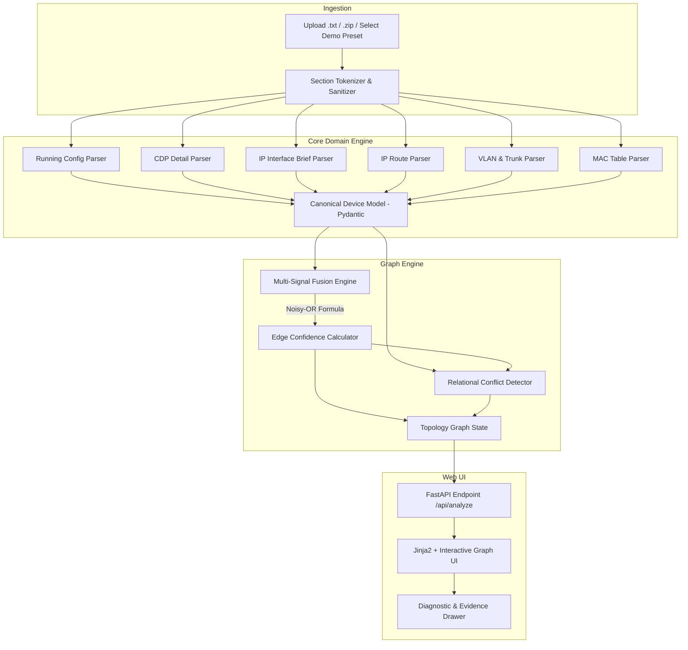

# Design Specification: Network Configuration Evaluation and Topology Discovery Tool (Standalone Phase 1)

**Date:** 2026-08-31  
**Project:** Network Configuration Evaluation and Topology Discovery Tool  
**Institution:** First City Providential College — Capstone Group 1  
**Status:** Approved for Implementation  

---

## 1. Overview & Objectives

This specification defines the standalone **Multi-Signal Network Topology Discovery & Diagnostic Visualizer**, the foundational subsystem of the Network Configuration Evaluation and Topology Discovery Tool.

### Primary Objectives for Presentation Demo:
1. **Multi-File Cisco Output Parsing:** Ingest and parse student command bundles (`.txt` files containing `show running-config`, `show cdp neighbors detail`, `show ip interface brief`, `show ip route`, `show vlan brief`, `show interfaces trunk`, and `show mac address-table`).
2. **Multi-Signal Graph Inference:** Infer physical and logical network links using a formal **Noisy-OR probabilistic fusion algorithm** combining authoritative Layer 2 signals (CDP, Trunk, MAC) with Layer 3 signals (Subnets, Routing next-hops).
3. **Cross-Device Relational Conflict Detection:** Detect relational errors across devices (IP subnet mismatch across physical link, interface down/cabling error, duplicate IP addresses, VLAN trunk mismatch, missing next-hops) with line-number evidence citations.
4. **Interactive Web Visualizer:** Render an interactive network topology diagram (FastAPI + Jinja2 + Vis.js/Canvas) complete with confidence badges, diagnostic drawer, and 1-click presentation presets.

---

## 2. System Architecture



---

## 3. Data Models (`Pydantic`)

### 3.1 Interface Model
```python
class InterfaceData(BaseModel):
    name: str
    ip_address: str | None = None
    subnet_mask: str | None = None
    cidr: int | None = None
    network_address: str | None = None
    admin_status: str = "up"         # up / administratively down
    line_status: str = "up"          # up / down
    is_switchport: bool = False
    switchport_mode: str | None = None # access / trunk
    access_vlan: int | None = None
    trunk_allowed_vlans: list[int] = []
    trunk_native_vlan: int = 1
    description: str | None = None
    evidence_lines: dict[str, int] = {}
```

### 3.2 CDP Neighbor Record
```python
class CDPNeighbor(BaseModel):
    device_id: str
    local_interface: str
    remote_interface: str
    capabilities: list[str] = []
    remote_ip: str | None = None
    platform: str | None = None
    evidence_line: int | None = None
```

### 3.3 Device Model
```python
class ParsedDevice(BaseModel):
    hostname: str
    canonical_name: str
    device_type: str                 # router / switch / l3_switch / host
    raw_filename: str
    interfaces: dict[str, InterfaceData] = {}
    cdp_neighbors: list[CDPNeighbor] = []
    routes: list[dict] = []
    mac_table: list[dict] = []
    vlans: dict[int, str] = {}
```

### 3.4 Discovered Link & Conflict Models
```python
class ContributingSignal(BaseModel):
    signal_type: str
    description: str
    weight: float
    evidence: list[str]

class DiscoveredLink(BaseModel):
    source_device: str
    source_interface: str
    target_device: str
    target_interface: str
    confidence: float
    classification: str              # verified (>=0.80) / inferred (0.40-0.79) / unverified (<0.40)
    signals: list[ContributingSignal]
    is_bidirectional: bool = True
    conflicts: list[str] = []

class ConflictIssue(BaseModel):
    severity: str                    # error / warning / info
    category: str                    # subnet_mismatch / link_down / duplicate_ip / vlan_mismatch / routing_missing
    title: str
    description: str
    involved_devices: list[str]
    involved_interfaces: list[str]
    evidence_citations: list[str]    # e.g. ["R1.txt: line 42", "R2.txt: line 38"]
```

---

## 4. Multi-Signal Fusion & Conflict Engine

### 4.1 Signal Weights Catalog
The probability of a true physical/logical link given multiple contributing signals is computed using Noisy-OR:

$$P = 1 - \prod_{s \in S} (1 - W_s)$$

| Signal Key | Description | Weight ($W_s$) |
|---|---|---|
| `CDP_NEIGHBOR_DETAIL` | `show cdp neighbors detail` explicit record | $1.00$ |
| `OSPF_NEIGHBOR_FULL` | Active dynamic OSPF adjacency in state FULL | $0.95$ |
| `P2P_SUBNET_30_31` | Both interfaces in identical `/30` or `/31` subnet | $0.90$ |
| `ROUTER_ON_A_STICK_VLAN` | Router subinterface dot1Q matched to Switch trunk VLAN | $0.85$ |
| `TRUNK_CONFIG_PAIR` | Matching trunk encapsulation & native VLAN configuration | $0.80$ |
| `NEXT_HOP_ROUTING_MATCH` | Route next-hop IP matches adjacent device's interface IP | $0.75$ |
| `MAC_TABLE_UPLINK` | Switch MAC table shows learned MACs on port | $0.70$ |
| `SHARED_SUBNET_24` | Interfaces share a `/24` broadcast subnet | $0.35$ |
| `DESCRIPTION_HINT` | Interface description matches neighbor device name | $0.25$ |

### 4.2 Cross-Device Conflict Rules
1. **Subnet Mismatch on Physical Link:** Physical link confirmed via CDP, but IP addresses belong to different subnets.
2. **Cabling / Protocol Down Error:** Configured IP exists on both ends, but `show ip int brief` reports `down/down` or `administratively down`.
3. **Duplicate IP Detection:** Scan all devices for duplicate IP assignments.
4. **Trunk / Native VLAN Mismatch:** Mutual trunk connection with conflicting native VLANs or missing allowed VLANs.
5. **Route Disconnect / Missing Next-Hop:** Static route next-hop configured to an IP address unreachable on adjacent subnets.

---

## 5. Web Interface & Preset Scenarios

### 5.1 Presentation UI Views
1. **Hero & Upload Bar:** Multi-file drag & drop, file list preview, and "Analyze Network" button.
2. **1-Click Preset Scenarios (Presentation Ready):**
   - *Preset 1: Standard 3-Router OSPF Lab (All links verified & clean).*
   - *Preset 2: Subnet Mismatch & Interface Down Lab (Highlights red conflict edge & line citations).*
   - *Preset 3: Multi-Switch VLAN & Trunk Mismatch Lab (Highlights trunk/native VLAN errors).*
3. **Interactive Graph Canvas:** Color-coded links (Green = Verified $\ge 0.80$, Amber = Inferred $0.40-0.79$, Red = Conflict / Error).
4. **Diagnostic & Evidence Drawer:** Displays contributing signals, exact confidence calculation, and clickable line number citations.

---

## 6. Testing & Quality Assurance Plan

1. **Unit Tests (`pytest`):**
   - `test_section_splitter.py`: Verify command splitting against noisy student pastes.
   - `test_cisco_parser.py`: Verify parsing of interfaces, IPs, CDP, routes, VLANs, and MAC tables.
   - `test_fusion_engine.py`: Verify Noisy-OR confidence scores and edge classifications.
   - `test_conflict_detector.py`: Verify detection of subnet mismatch, down links, duplicate IPs, and VLAN trunk errors.
2. **End-to-End & UI Verification:**
   - FastAPI test client tests for `/api/analyze` and `/api/presets/{preset_id}`.
   - Browser rendering test of the interactive graph UI.
