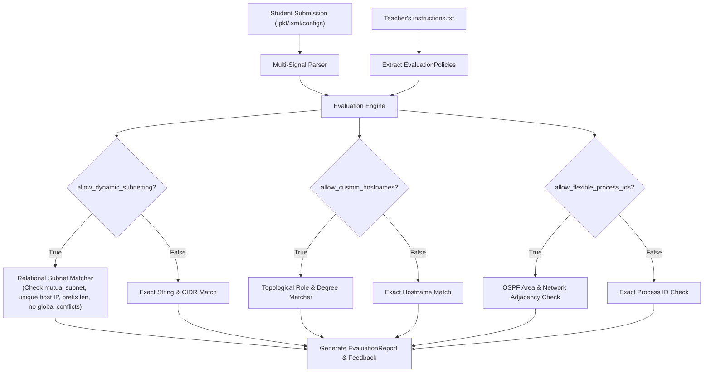

# Design Spec: Instructor Policy Toggles & Dynamic Relational Grading Engine

**Date:** 2026-09-08  
**Topic:** Dynamic Rubric Configuration & Instructor Evaluation Policies  
**Status:** Ready for Plan & Implementation  

---

## 1. Overview & Research Background

In networking education and Cisco Academy laboratories, student assessments span two distinct pedagogical paradigms:
1. **Strict Implementation**: Students must configure exact assigned IP addresses, specific hostnames, and exact physical port numbers.
2. **Architectural & Relational Implementation (Dynamic Subnetting / Custom Schemes)**: Students are tasked with designing their own subnetting scheme (or given student-unique variable IP blocks), using custom device naming conventions, or focusing on functional convergence (routing, VLAN trunks, operational status).

This specification introduces **Instructor Policy Toggles** into the **Instructor Studio** and **Automated Evaluation Engine**, giving instructors one-click control over grading strictness while preserving 100% deterministic, offline evaluation.

---

## 2. Policy Schema & Data Models (`src/models.py`)

### 2.1 `EvaluationPolicies` Model

```python
class EvaluationPolicies(BaseModel):
    # IP & Subnetting Policies
    allow_dynamic_subnetting: bool = False      # If True: verifies mutual subnet matching, CIDR & uniqueness rather than exact IP
    enforce_prefix_length: bool = True          # If True: requires student's custom subnet to match required CIDR (e.g. /30 for P2P, /24 for LAN)
    verify_default_gateways: bool = True        # If True: verifies PCs/Switches have default gateway matching connected router subnet

    # Topology & Hardware Policies
    allow_custom_hostnames: bool = False        # If True: matches devices by type, topological role, and neighbor links
    strict_port_matching: bool = True           # If False: allows equivalent interfaces of same speed class
    strict_cable_type: bool = True              # If False: allows Auto-MDIX copper equivalence (Straight-Through vs Cross-Over)

    # Routing, Security & Documentation Policies
    allow_flexible_process_ids: bool = True     # If True: ignores locally-significant OSPF/EIGRP process IDs; checks Area & networks
    grade_security_baseline: bool = False       # If True: checks 'enable secret', 'service password-encryption', 'line vty'
    grade_interface_descriptions: bool = False  # If True: checks descriptive interface labels matching peer

class EvaluationCriteria(BaseModel):
    lab_title: str
    lab_description: str
    total_points_possible: float = 100.0
    policies: EvaluationPolicies = Field(default_factory=EvaluationPolicies)
    rules: list[EvaluationRule] = Field(default_factory=list)
```

---

## 3. Rubric & Lab Instructions Generation (`src/criteria_generator.py`)

### 3.1 Policy-Aware Rule Extraction
When extracting rules from a gold-standard reference `.pkt`/`.xml` or config bundle:
- If `grade_security_baseline` is `True`: generates rules for `enable_secret`, `service_password_encryption`, and `vty_login`.
- If `grade_interface_descriptions` is `True`: generates rules for interface `description` statements.
- If `allow_dynamic_subnetting` is `True`: rules record `category: "relational_subnet"`, storing the expected prefix length and connected peer rather than fixed IP string.

### 3.2 Dual-Format Output (`instructions.txt`)
- **Human-Readable Assignment**:
  - If `allow_dynamic_subnetting == False`: Displays exact Addressing Table (e.g., `R1 Gi0/0: 192.168.1.1/24`).
  - If `allow_dynamic_subnetting == True`: Displays dynamic guidance (e.g., `R1 Gi0/0: Valid host IP in /24 subnet (must match LAN gateway and share subnet with PC1)`).
  - Displays Policy Summary section highlighting whether custom hostnames, dynamic subnetting, or Auto-MDIX are permitted.
- **Embedded Schema**:
  - Stores `policies` within the JSON spec delimiter (`--- CRITERIA SPEC START ---` ... `--- CRITERIA SPEC END ---`).

---

## 4. Deterministic Relational Evaluation Engine (`src/evaluator.py`)



### 4.1 Dynamic Subnet Validation Algorithm
For each expected link between `(DeviceA, PortA)` and `(DeviceB, PortB)`:
1. **IP Presence**: Ensure both interfaces have configured IPv4 addresses.
2. **Subnet Equivalence**: Compute `net_a = IPv4Interface(ip_a).network` and `net_b = IPv4Interface(ip_b).network`. Assert `net_a == net_b`.
3. **Host Uniqueness**: Assert `ip_a != ip_b` (no duplicate IP on the wire).
4. **Prefix Enforcement**: If `enforce_prefix_length`, assert `net_a.prefixlen == expected_prefixlen`.
5. **Conflict Resistance**: Ensure `net_a` is not reused on other unrelated point-to-point links in the student's submission.
6. **Gateway Consistency**: If `verify_default_gateways`, verify host/switch default gateway belongs to `net_a`.

---

## 5. Frontend UI/UX Enhancements

### 5.1 Instructor Studio Policy Panel (`templates/index.html` & `static/css/style.css`)
Inside the Instructor Authoring card, provide a grouped, responsive policy toggle grid:

- **🌐 IP & Subnetting Policies**:
  - `[ ]` **Allow Dynamic Subnetting** (*Students use custom subnets; evaluator checks relational consistency*)
  - `[x]` **Enforce Prefix Length** (*Ensures custom subnets match required /30, /24, etc.*)
  - `[x]` **Verify Default Gateway Binding** (*Ensures PC/Switch gateway matches router LAN IP*)

- **🗺️ Topology & Hardware Policies**:
  - `[ ]` **Allow Flexible Device Names** (*Accepts custom hostnames matched by topological role*)
  - `[x]` **Strict Port Numbers** (*Requires exact interface matching e.g. Gi0/0*)
  - `[x]` **Strict Cable Type** (*Enforces Straight-Through vs Cross-Over vs Serial*)

- **⚙️ Routing & Security Policies**:
  - `[x]` **Allow Flexible OSPF Process IDs** (*Accepts any process ID if Area 0 & networks match*)
  - `[ ]` **Grade Security Baseline** (*Checks enable secret, service password-encryption, VTY*)
  - `[ ]` **Grade Interface Descriptions** (*Checks documentation labels on active links*)

---

## 6. Verification Plan

1. **Unit Tests**:
   - `test_criteria_generator_with_policies`: Verify policies serialize and deserialize cleanly in `instructions.txt`.
   - `test_evaluator_dynamic_subnetting_valid`: Valid student submission with a different IP range (e.g. `10.50.0.0/30` instead of `192.168.1.0/30`) passes 100%.
   - `test_evaluator_dynamic_subnetting_mismatched_pair`: Student configures R1 with `10.50.0.1/30` and R2 with `10.50.1.2/30` (different subnets) $\rightarrow$ fails with diagnostic feedback.
   - `test_evaluator_flexible_hostnames`: Student names routers `Router_East` and `Router_West` instead of `R1` and `R2` $\rightarrow$ passes when enabled, fails when disabled.
   - `test_evaluator_flexible_ospf_process_id`: Student uses `router ospf 99` instead of `router ospf 1` $\rightarrow$ passes when enabled.
2. **Live Browser End-to-End Verification**:
   - In Instructor Studio, toggle policies, generate `instructions.txt`, upload in Student Portal, and verify scoring in headless browser.
